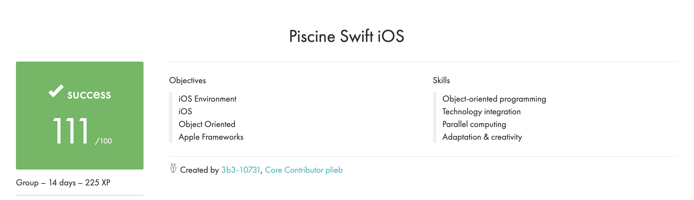

# SWIFT IOS

## Prerequisites
* swift
* xcode 10+

## Description
2 Weeks. Intensive programming bootcamp. Basics of OOP, parallel computing and Apple frameworks are covered during this bootcamp.

## Overall Achievements


## File Structure
```
swift_ios
│
│   README.md
│   
└───docs
│   │
│   └───pdfs (pdfs for each day's exercises)
│
│   overview.png
│
└───day00
│
└───day01
│   
└───day02
│
└───day03
│
└───day04
│
└───day05
│
└───day06
│
└───day07
│
└───day08
│
└───rush00  
```
